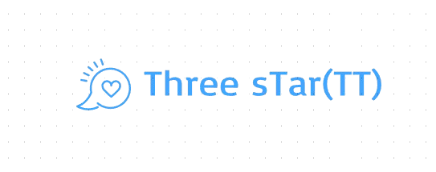

<!-- Heading -->

# 📘 프로젝트 소개

ThreeStars 프로젝트는 KH Academy 내 구성원들이 자유롭고 실시간으로 소통할 수 있는 커뮤니케이션 플랫폼을 구축하고자 시작되었습니다.  
오프라인 소통이 줄어든 상황 속에서, 학원 내에서 수강생들 간의 원활한 소통을 돕고자 하는 필요성이 제기되었습니다.  
단순한 메신저가 아니라, 학습과 협업을 위한 맞춤형 인트라넷 시스템을 지향하며,   학원 구성원들의 유대감 형성과 커뮤니케이션 효율 향상에 기여하고자 합니다.  

   

# ⏱ 개발기간

   

# 🎈 구성원 및 역할

<h2 style="border-bottom : none">🧡 조장 : 서동진</h2>

- 회원가입
  - 주소 API (행정 안전부)
- 로그인
    - SNS 간편로그인 (Naver)
- 메인페이지
    - 필터링 / 키워드검색
    - Pick!

- book API(도서 정보 나루)
  - 인기 도서 목록 조회
  - 도서 정보 상세 페이지 조회
  - 도서 검색 기능
  - 도서관 정보 기능

 <h2 style="border-bottom : none">🤎 조원 : 이호석</h2>

  - 찜하기
  - 로그인
      - SNS 간편로그인 (Google)
  - 마이페이지(메뉴)
      - 정보변경/탈퇴
      - 찜하기
      - 감상문
  - 고객센터
      - 문의 
      - 상담 
      - FAQ 
      - 공지사항

  <h2 style="border-bottom : none">💙 조원 : 고영훈</h2>

- 로그인
    - SNS 간편로그인 (kakao)
- 도서정보 상세페이지조회
    - 리뷰 조회/작성/수정/삭제
    - 좋아요
    - 별점
- 자유게시판
    - 게시 조회/작성/수정/삭제
- 온라인 투표

   

# ⚙ 개발 환경 
- OS : Windows10/11
- Developer Tools : Eclipse / VS Code / SqlDeveloper
- Server : (Apach Tomcat 9.0)
- DBMS : Oracle
- Front-end : HTML5 / CSS3 / JavaScript / jQuery
- BackEnd : Java 11, JSP & Servlet
- UseCase Diagram : StarUML
- E-R Diagram : ERD CLOUD
- Management : GitHub
- Visily / Figma
   

# ⚙ API
- [네이버 개발자 센터](https://developers.naver.com/main/)
- [카카오 개발자 센터](https://developers.kakao.com/)
- [구글 개발자 센터 (한국어)](https://developers.google.com/?hl=ko)
- [도로명주소 API](https://business.juso.go.kr/addrlink/openApi/apiReqst.do)
- [국립중앙도서관 - 공공데이터](https://www.data4library.kr/)

   

# ✔ 설계
ERD Cloud : 

   

# 📽 프로젝트 구현
<h2 style="border-bottom : none">🧡 조장 : 서동진</h2>

## ◽ 메인페이지  

  

## ◽ 로그인  

  

## ◽ 회원가입  

## ◽ 아이디 찾기  

## ◽ 비밀번호 찾기  

## ◽ 베스트 셀러  

## ◽ 도서 정보 상세 페이지  

## ◽ 도서 검색 기능  

  
  

# 
<h2 style="border-bottom : none">🤎 조원 : 이호석</h2>

  ## ◽ SNS 간편로그인(Google) 

  ## ◽ 마이페이지 - 정보변경/탈퇴 

  ## ◽ 마이페이지 - 감상문 

  ## ◽ 찜하기 

  ## ◽ 고객센터 - 문의글 작성/조회/수정/삭제 

 ## ◽ 고객센터 - F&Q 

  

# 💙 조원 : 고영훈
  

 ## ◽ 카카오 로그인(API)

 

 ## ◽ 자유 게시판(작성, 수정, 삭제)

 

 ## ◽ 자유 게시판 (댓글 기능)

 

 ## ◽ 온라인 투표 (작성, 수정, 삭제)

 

 ## ◽ 온라인 투표 (댓글 기능)

 

 ## ◽ 온라인 투표 (투표 기능)

 

 ## ◽ 책 리뷰 작성

 

 ## ◽ 팔로우 / 언팔로우 기능

   

# 📚 최종 보고서 확인

<a href="./WebContent/resources/assets/This.서고_최종보고서.pdf" download>📄 This.서고_최종보고서.pdf</a>
