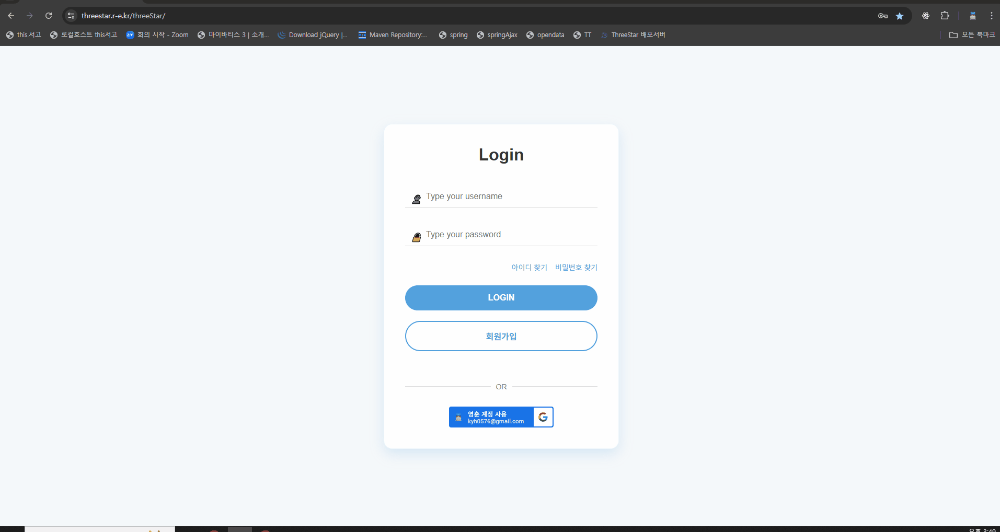

<!-- Heading -->

# 📘 프로젝트 소개

ThreeStars 프로젝트는 KH Academy 내 구성원들이 자유롭고 실시간으로 소통할 수 있는 커뮤니케이션 플랫폼을 구축하고자 시작되었습니다.  
오프라인 소통이 줄어든 상황 속에서, 학원 내에서 수강생들 간의 원활한 소통을 돕고자 하는 필요성이 제기되었습니다.  
단순한 메신저가 아니라, 학습과 협업을 위한 맞춤형 인트라넷 시스템을 지향하며,   학원 구성원들의 유대감 형성과 커뮤니케이션 효율 향상에 기여하고자 합니다.  

   

# ⏱ 개발기간

   

# 🎈 구성원 및 역할

<h2 style="border-bottom : none">🧡 조장 : 고영훈</h2>

- 회원가입
- 로그인
- 메인페이지
    - Class 및 사용자 조회
    - 사용자 상세 조회 및 사용자 이름 변경(친구 등록시)
    - 친구 추가, 수락 및 거절
    - 실시간 온라인 유저 조회
    - 클래스 일정 조회

- AWS EC2를 이용한 배포
- GitHub Webhook을 이용한 자동화 배포
- SSL인증서를 이용한 HTTP -> HTTPS 변환

 <h2 style="border-bottom : none">🤎 조원 : 서동진</h2>

  - 찜하기
  - 로그인
      - SNS 간편로그인 (Google)
  - 마이페이지(메뉴)
      - 정보변경/탈퇴
      - 찜하기
      - 감상문
  - 고객센터
      - 문의 
      - 상담 
      - FAQ 
      - 공지사항

  <h2 style="border-bottom : none">💙 조원 : 이용훈</h2>

- 로그인
    - SNS 간편로그인 (Google)
    - 회원 정보 변경/탈퇴
- 캘린더
    - 구글 캘린더
    - 일반 캘린더
    - 채팅방 내 캘린더
- 티서랍
    - 조회
    - 다운로드
- 테스트코드(JUnit)

   

# ⚙ 개발 환경 
- OS : Windows10/11
- Developer Tools : Eclipse / VS Code / SqlDeveloper / STS
- Server : (Apach Tomcat 9.0)
- DBMS : Oracle
- Front-end : HTML5 / CSS3 / JavaScript / jQuery
- BackEnd : Java 11, JSP & Servlet, Mybatis
- Framework : Spring
- UseCase Diagram : StarUML
- E-R Diagram : ERD CLOUD
- Management : GitHub
- Visily / Figma
   

# ⚙ API
- [네이버 개발자 센터](https://developers.naver.com/main/)
- [카카오 개발자 센터](https://developers.kakao.com/)
- [구글 개발자 센터 (한국어)](https://developers.google.com/?hl=ko)
- [도로명주소 API](https://business.juso.go.kr/addrlink/openApi/apiReqst.do)
- [국립중앙도서관 - 공공데이터](https://www.data4library.kr/)

   

# ✔ 설계
ERD Cloud : 

   

# 📽 프로젝트 구현
<h2 style="border-bottom : none">🧡 조장 : 고영훈</h2>

## ◽ 로그인  

  

## ◽ 회원가입  

## ◽ 아이디 / PW 찾기  

## ◽ Class 및 사용자 조회  

## ◽ Class 일정 조회  

## ◽ 친구추가 및 이름변경  

## ◽ 실시간 온라인 유저 조회  

  
  

# 
<h2 style="border-bottom : none">🤎 조원 : 이용훈</h2>

  ## ◽ SNS 간편로그인(Google) 

  ## ◽ 캘린더 - (일반, 구글캘린더) 

  ## ◽ 티서랍 

  ## ◽ MIME 타입 

  ## ◽ 채팅방 내 캘린더 

 ## ◽ 테스트코드 

 

# <h2 style="border-bottom : none">💙 조원 : 서동진
  

 ## ◽ 카카오 로그인(API)

 

 ## ◽ 자유 게시판(작성, 수정, 삭제)

 

 ## ◽ 자유 게시판 (댓글 기능)

 

 ## ◽ 온라인 투표 (작성, 수정, 삭제)

 

 ## ◽ 온라인 투표 (댓글 기능)

 

 ## ◽ 온라인 투표 (투표 기능)

 

 ## ◽ 책 리뷰 작성

 

 ## ◽ 팔로우 / 언팔로우 기능

   

# 📚 최종 보고서 확인

<a href="./threeStar/src/main/webapp/resources/asset/threeStar최종보고서.pdf" download>📄 threeStar_최종보고서.pdf</a>
